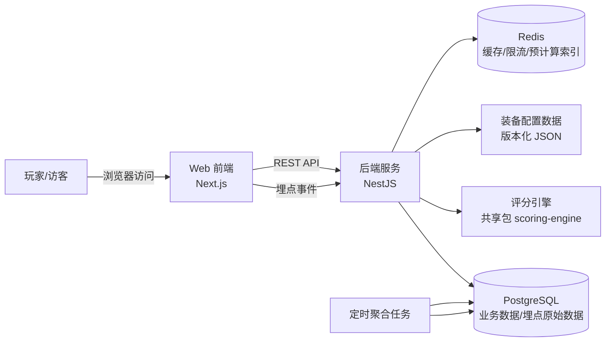
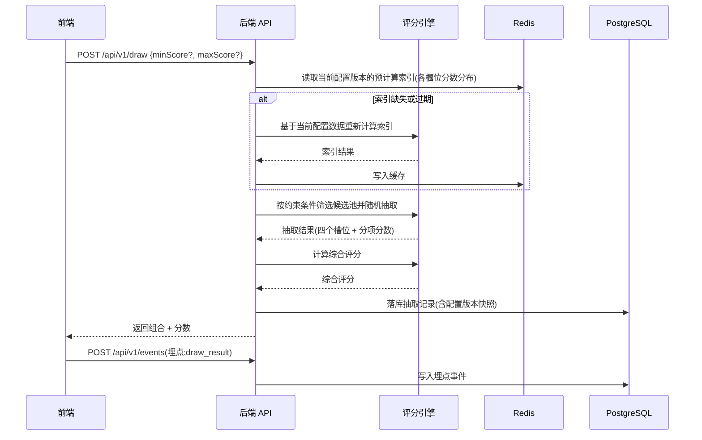

# 系统架构文档

> 版本:v0.1 最后更新:2026-07-21
> 关联文档:`01-prd/PRD.md`、`03-spec/*`、`decisions/0001-tech-stack.md`

## 1. 架构目标与原则

1. **配置驱动,而非硬编码**:游戏内容(武器/头盔/护甲/干员分数)会随游戏版本频繁变化,必须与业务代码解耦,改分数不改代码、不重新发版后端。
2. **MVP 从简,但骨架为扩展预留**:初期用最小可行的技术组合跑通功能,但目录结构、模块边界从第一天就按"未来会拆分"设计,避免后期大重构。
3. **关注点分离**:评分引擎(纯计算逻辑)、装备配置(数据)、抽取服务(业务流程)、埋点服务(数据采集)四者边界清晰,可独立测试、独立演进。
4. **AI Agent 友好**:目录结构、命名、模块职责保持强约定(Convention over Configuration),降低 AI 生成代码时的歧义空间。
5. **可观测优先于炫技**:优先保证埋点、日志、错误追踪能跑起来,而不是追求花哨的前端效果。

## 2. 系统上下文图



## 3. 技术栈选型

| 层              | 选型                                                 | 理由                                                                              |
| --------------- | ---------------------------------------------------- | --------------------------------------------------------------------------------- |
| 前端框架        | Next.js(App Router) + TypeScript                     | SSR/SEO 友好,利于内容分享传播;生态成熟,AI Agent 训练数据覆盖充分,生成代码质量稳定 |
| UI              | Tailwind CSS + shadcn/ui                             | 快速搭建一致的视觉体系,减少自定义 CSS 维护成本                                    |
| 状态管理        | React Query(服务端数据) + 轻量 Zustand(本地 UI 状态) | 避免过度设计,按数据来源分层管理状态                                               |
| 后端框架        | NestJS + TypeScript                                  | 强约定的模块/控制器/服务分层,天然适合"多人/多 Agent 协作开发",降低代码风格发散    |
| ORM             | Prisma                                               | 类型安全,Schema 即文档,迁移管理成熟                                               |
| 数据库          | PostgreSQL                                           | 关系型数据 + JSONB 字段,足够支撑业务数据与埋点原始数据,后续可平滑迁移分析型存储   |
| 缓存/限流       | Redis                                                | 抽取接口限流、评分区间预计算索引缓存                                              |
| 包管理/仓库结构 | pnpm workspaces(Monorepo)                            | 前后端共享类型与评分引擎逻辑,避免逻辑漂移                                         |
| 部署            | Docker Compose(本地/自托管)+ Vercel(前端,可选)       | 前期低成本,后期可迁移到任意云厂商,不锁定 Vercel 特有能力                          |
| 监控            | 结构化日志(pino) + 错误追踪(Sentry,后续接入)         | MVP 阶段最低成本满足可观测需求                                                    |

> 技术选型的详细取舍记录见 `decisions/0001-tech-stack.md`。任何变更选型都需要新增一份 ADR,不能只改本表格。

## 4. Monorepo 模块划分

```
GearBlindBox/
├── apps/
│   ├── web/                 # Next.js 前端应用
│   └── api/                 # NestJS 后端应用
├── packages/
│   ├── scoring-engine/      # 纯函数评分引擎:输入装备数据+权重,输出分数(无副作用,单测覆盖率要求最高)
│   └── shared-types/        # 前后端共享的 TypeScript 类型定义(装备、组合、API DTO)
├── configs/
│   └── game-data/           # 武器/头盔/护甲/干员的版本化配置数据(JSON),见 CONFIG-SCHEMA.md
└── docs/                    # 本文档体系
```

**模块职责边界**:

- `scoring-engine` 不依赖数据库、不依赖网络请求,只做"给定输入数据,计算输出分数/判断是否在区间内"的纯计算,保证可以脱离后端独立单测。
- `apps/api` 负责:加载配置数据 → 调用 `scoring-engine` → 组装抽取结果 → 落库/埋点 → 返回给前端。业务流程编排在这一层,不在引擎层。
- `apps/web` 只做展示与交互,不做评分计算(即使为了快速反馈做前端预览,最终结果也必须以后端返回为准,避免前后端分数不一致)。
- `configs/game-data` 是内容数据,变更走"配置发布"流程而非"代码发布"流程(详见 `CONFIG-SCHEMA.md`)。

## 5. 核心数据流:一次抽取的完整链路



## 6. 数据存储方案

| 数据类型                      | 存储位置                                                            | 说明                                                  |
| ----------------------------- | ------------------------------------------------------------------- | ----------------------------------------------------- |
| 装备/干员基础数据(分数、属性) | Git 仓库内的版本化 JSON 文件                                        | 内容型配置,走代码评审流程,但不等同于业务代码          |
| 当前生效配置版本指针          | `configs/game-data/manifest.json` (V0.1) → 后续可迁移至 DB 的配置表 | V0.1 用文件足够,V1.0 后台可视化维护配置时迁移到数据库 |
| 用户抽取记录                  | PostgreSQL `draw_records` 表                                        | 含配置版本快照,保证历史结果不被后续调整影响           |
| 埋点原始事件                  | PostgreSQL `events` 表(JSONB properties)                            | 初期用关系库即可满足量级,量级增长后迁移方案见第 8 节  |
| 聚合指标(DAU/留存等)          | PostgreSQL 汇总表,由定时任务生成                                    | 避免每次查询都全表扫描原始事件表                      |
| 评分区间预计算索引            | Redis                                                               | 按配置版本缓存,配置发布新版本后需要主动失效重建       |

## 7. 部署架构

- **本地开发**:`docker-compose.yml` 一键拉起 Postgres + Redis;`apps/web`、`apps/api` 用各自的 dev server。
- **生产环境(V0.1 建议)**:前端部署到 Vercel(或任意支持 Next.js 的平台);后端 + Postgres + Redis 用 Docker 部署在单台云主机(如轻量应用服务器),量级不大时无需 Kubernetes。
- **环境变量管理**:所有环境变量必须有 zod/schema 校验,启动时校验失败直接 fail-fast,禁止运行时才暴露配置错误。
- **CI 流程(最低要求)**:lint → typecheck → 单元测试(重点是 scoring-engine)→ 配置文件 Schema 校验 → build。

## 8. 演进路线(架构视角,与 `05-roadmap/ROADMAP.md` 对齐)

| 阶段      | 架构变化                                                                                                                                                                |
| --------- | ----------------------------------------------------------------------------------------------------------------------------------------------------------------------- |
| MVP(V0.1) | 单体式 Nest API + Next 前端,Postgres 存一切,评分区间用"约束筛选 + 拒绝采样"实时计算                                                                                     |
| V0.2      | 引入定时聚合任务计算 DAU/留存等指标;评分区间预计算索引接入 Redis                                                                                                        |
| V1.0      | 引入账号体系(可选登录);抽取记录与账号关联,支持"历史记录"页面                                                                                                            |
| V1.5+     | 埋点原始数据量增长后,评估迁移到 ClickHouse 或类似 OLAP 存储;配置数据从文件迁移到数据库 + 管理后台可视化维护;评估拆分埋点采集为独立轻量服务(避免影响主业务 API 的可用性) |

## 9. 非功能性需求

- **性能**:抽取接口 P95 响应时间 < 500ms(不含极端评分区间反复重试的边界场景,边界场景兜底策略见 `SCORING-SPEC.md`)。
- **安全**:抽取与埋点接口需基于匿名标识做速率限制,防止脚本刷接口污染数据;所有输入需做 schema 校验(zod/class-validator),不信任任何前端传入的分数计算结果。
- **可用性**:核心抽取功能不依赖第三方服务,避免外部服务不可用拖垮主功能。
- **可维护性**:任何"新增/调整装备分数"的操作,不应要求触碰 `apps/api` 或 `apps/web` 的业务代码。
- **可测试性**:`scoring-engine` 目标单测覆盖率 ≥ 90%(核心业务逻辑,详见 `CODING-STANDARDS.md`)。

## 10. 风险与应对

| 风险                                     | 应对                                                                               |
| ---------------------------------------- | ---------------------------------------------------------------------------------- |
| 评分区间过窄导致抽取算法长时间找不到结果 | `SCORING-SPEC.md` 中定义约束传播预筛 + 最大重试次数 + 明确失败提示,避免死循环      |
| 游戏版本更新频繁,配置维护跟不上          | 配置文件按类别+版本号拆分,变更粒度小,支持单类别独立发版(如只更新武器,不动干员)     |
| 埋点数据量增长后拖慢主业务数据库         | 埋点写入与业务写入使用同一 DB 但不同表,提前预留"迁移到独立存储"的架构位(见第 8 节) |
| 早期过度设计导致 MVP 交付变慢            | 严格遵守 PRD 中定义的 MVP 范围,账号体系/管理后台等明确推迟到后续版本               |
