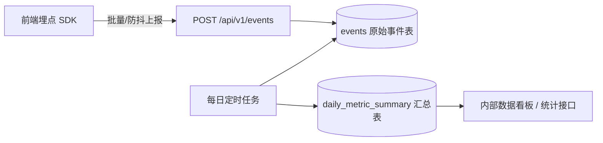

# 埋点与数据分析规范

> 版本:v0.1 最后更新:2026-07-21
> 目的:用最小成本的自建埋点管道,支撑 PV/UV/DAU/留存等商业化评估指标的计算,同时明确隐私合规边界。

## 1. 指标定义与计算口径

明确的口径定义是数据可信度的基础,以下口径为项目**唯一标准**,所有报表/看板必须按此计算,不允许各自发明口径。

| 指标                        | 定义                                           | 计算方式                                                 |
| --------------------------- | ---------------------------------------------- | -------------------------------------------------------- |
| PV(浏览量)                  | 页面被加载的总次数                             | 统计当日 `page_view` 事件总数                            |
| UV(独立访客)                | 当日出现过至少一次事件的去重 `anonymous_id` 数 | `COUNT(DISTINCT anonymous_id)`                           |
| 新访客(New Visitor)         | `anonymous_id` 首次出现的访问                  | 该 `anonymous_id` 的最早事件时间落在当日                 |
| 复访访客(Returning Visitor) | 非当日首次出现的访客                           | 当日 UV 中排除新访客                                     |
| DAU                         | 当日活跃独立设备数(等价于 UV,统计口径合并)     | 与 UV 计算方式一致,DAU 是业务语境下的别名                |
| WAU / MAU                   | 近 7 日 / 30 日活跃独立设备数                  | `COUNT(DISTINCT anonymous_id)` over 滚动窗口             |
| 次日留存率(D1 Retention)    | T 日新访客中,T+1 日仍活跃的比例                | `T+1日活跃的T日新访客数 / T日新访客总数`                 |
| 7日/30日留存率              | 同上,窗口改为 T+7 / T+30                       | 同上逻辑                                                 |
| 抽取转化率                  | 当日触发过抽取行为的访客数 / 当日 UV           | `COUNT(DISTINCT anonymous_id WHERE draw_triggered) / UV` |
| 人均抽取次数                | 当日抽取总次数 / 当日触发过抽取的访客数        | 反映核心功能的使用深度                                   |
| 区间筛选使用率              | 设置过评分区间的抽取次数 / 抽取总次数          | 反映 F3 功能的实际使用价值,判断是否值得投入优化          |

## 2. 匿名标识方案

- 前端首次加载时,检测 `localStorage` 是否存在 `gbb_anonymous_id`,不存在则生成 UUID v4 并写入,之后所有请求通过 `X-Anonymous-Id` 请求头携带。
- 会话标识 `sessionId`:每次打开网站生成一个新的 UUID,存于 `sessionStorage`(浏览器关闭或标签页关闭后失效),用于区分"同一次访问中的多次抽取"与"跨天的多次访问"。
- 不使用 Cookie 做主要标识(规避跨站 Cookie 限制导致的数据丢失风险),`localStorage` 方案的已知局限(用户清除浏览器数据/更换设备会被识别为新访客)属于可接受的 MVP 精度损失,在 `ROADMAP.md` 中标注为账号体系上线后可优化项。

## 3. 事件清单

| eventName               | 触发时机                                    | properties                                                             |
| ----------------------- | ------------------------------------------- | ---------------------------------------------------------------------- |
| `page_view`             | 页面(路由)加载完成                          | `{ path: string, referrer?: string }`                                  |
| `session_start`         | 一次会话(sessionId 生成)的首个事件          | `{ }`                                                                  |
| `draw_triggered`        | 用户点击"抽取"按钮,请求发出时               | `{ hasScoreRange: boolean, minScore?: number, maxScore?: number }`     |
| `draw_result_shown`     | 抽取结果成功渲染                            | `{ totalScore: number, usedFallback: boolean, configVersion: string }` |
| `draw_infeasible_shown` | 抽取因区间不可达成而失败,提示展示给用户     | `{ minScore: number, maxScore: number }`                               |
| `score_range_set`       | 用户完成一次评分区间设定(滑块松开/输入确认) | `{ minScore: number, maxScore: number }`                               |
| `score_range_cleared`   | 用户清除评分区间设定                        | `{ }`                                                                  |
| `share_click`           | 用户点击分享按钮(V1.0 起)                   | `{ channel: string, totalScore: number }`                              |

- 所有事件必须携带 `sessionId`;`page_view`/`session_start` 由前端埋点 SDK(轻量封装,非第三方 SaaS)自动触发,业务事件由具体交互逻辑显式调用。
- `properties` 字段结构变更(新增字段允许,删除/改变字段类型视为 breaking change)必须在本文件更新并记录版本,分析层查询逻辑需同步确认兼容性。

## 4. 数据管道

- **采集层**:前端 SDK 对高频事件(如快速多次点击)做适度防抖/合并,减少无意义的请求量。
- **存储层**:V0.1 直接写入 PostgreSQL `events` 表(`properties` 用 JSONB),量级预估(早期日活几百到几千级别)完全可以支撑,不引入额外组件增加运维负担。
- **计算层**:每日定时任务(cron / 简单的 scheduled job,不引入重量级任务调度系统)按第 1 节口径计算前一日的汇总指标,写入 `daily_metric_summary` 表;留存率计算需要基于 cohort(按"首次出现日期"分组)扫描原始事件表,预计算后写入汇总表,避免看板查询时现算现查拖慢响应。
- **展示层**:V0.1 可以只提供一个内部只读的统计接口(`API-SPEC.md` 3.4 节)+ 简单页面或直接查 SQL;不需要在本轮实现复杂的可视化看板,优先保证数据被正确采集与计算。

## 5. 留存率计算方法(Cohort 表定义)

以"次日留存"为例,计算逻辑:

1. 确定 T 日的新访客队列(cohort):`anonymous_id` 的最早事件发生日期 = T。
2. 确定 T+1 日的活跃访客集合:`anonymous_id` 在 T+1 日有任意事件记录。
3. 次日留存率 = `|cohort(T) ∩ active(T+1)| / |cohort(T)|`。

7 日/30 日留存率替换步骤 2 的日期窗口即可,计算逻辑复用同一套 cohort 基础设施(建议实现为一个通用函数,传入窗口天数参数,而不是为每个留存周期各写一套逻辑)。

## 6. 隐私与合规

- 不采集任何个人身份信息(PII):不采集手机号、真实姓名、精确地理位置。
- 原始 IP 地址不落库,只存储哈希后的 `ipHash`,用于粗粒度异常流量识别,不用于定位到具体个人。
- 网站需提供简单的隐私说明(告知用户"本站通过匿名标识统计访问数据,不收集个人身份信息"),V0.1 至少在页面底部提供一行说明与联系方式,V1.0 前完善为独立隐私政策页面。
- 若后续引入账号体系或第三方分析 SaaS,需重新评估数据出境与合规要求,在对应 ADR 中记录评估结论。

## 7. 后续演进

- 数据量增长后(预估月活达到数万以上),评估将 `events` 原始表迁移到 ClickHouse 等 OLAP 存储,当前的表结构设计(扁平化 `eventName` + `properties` JSONB)已经兼容该迁移路径,不需要提前引入复杂度。
- 可并行接入开源自托管分析工具(如 Umami/Plausible)作为**交叉验证**,但不作为核心指标的唯一来源,核心指标口径始终以本文件定义为准。
- V1.0 引入账号体系后,需评估"匿名 ID 与账号 ID 的行为数据合并"逻辑,避免同一用户在登录前后被计为两个独立访客,影响留存率准确性。

## 8. 变更记录

| 日期       | 版本 | 说明                       |
| ---------- | ---- | -------------------------- |
| 2026-07-21 | v0.1 | 初版埋点事件与指标口径定义 |
