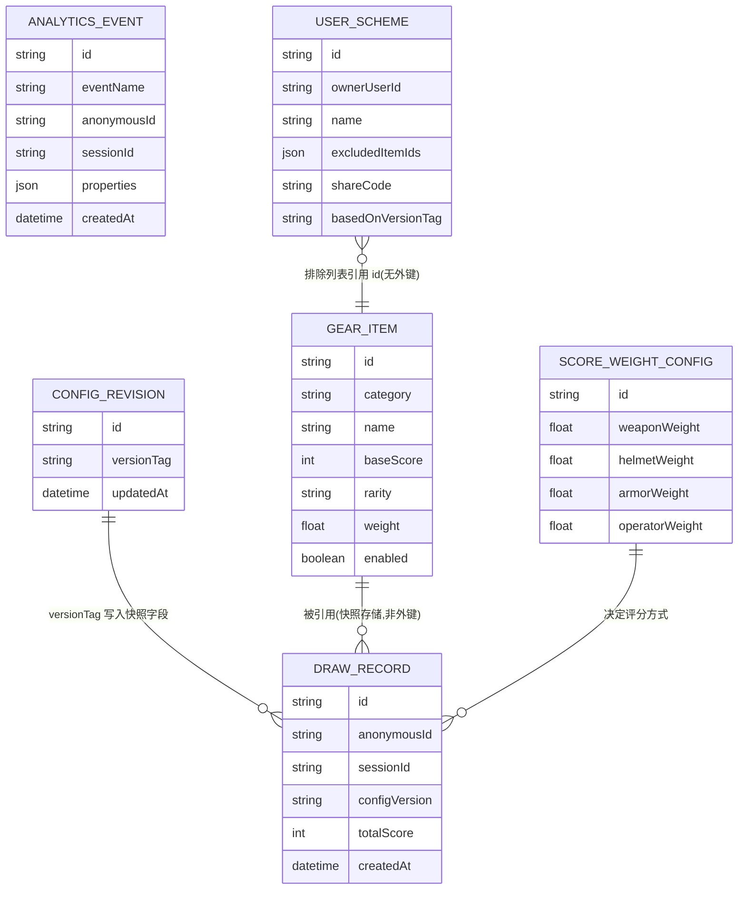

# 数据模型规范

> 版本:v0.3 最后更新:2026-07-22
> 本文件定义核心实体与字段契约。新增/修改字段必须先改本文件,再改 Prisma Schema / TypeScript 类型定义,保持三者一致。

## 1. 实体关系总览

> 说明:`DRAW_RECORD` 不与 `GEAR_ITEM` 建立外键,而是**存储快照**,保证历史记录反映抽取当时状态。`USER_SCHEME` 为后续版本预留实体,V0.1 **不建表、不实现**。

## 2. 官方配置实体(数据库表)

官方默认配置存放在 PostgreSQL,由 Prisma 管理。维护约束见 `CONFIG-SCHEMA.md`。

### 2.1 GearItem(`gear_items`)

四类装备共用同一表结构,通过 `category` 区分。

| 字段                      | 类型                                          | 必填      | 说明                                             |
| ------------------------- | --------------------------------------------- | --------- | ------------------------------------------------ |
| `id`                      | string                                        | ✅        | 主键,建议 `{category}_{slug}`,如 `weapon_ak12`   |
| `category`                | enum(`weapon`\|`helmet`\|`armor`\|`operator`) | ✅        | 装备类别,决定归属哪个抽取槽位                    |
| `name`                    | string                                        | ✅        | 展示名称(中文)                                   |
| `subCategory`             | string                                        | ❌        | 细分类别预留(如"步枪/狙击枪"),V0.1 不强制使用    |
| `baseScore`               | int(0-100)                                    | ✅        | 单项基础评分,仅官方可维护,详见 `SCORING-SPEC.md` |
| `rarity`                  | enum(`common`\|`rare`\|`epic`\|`legendary`)   | ❌        | 稀有度标签                                       |
| `weight`                  | float                                         | ❌,默认 1 | 抽取权重,越大越容易被抽到                        |
| `imageUrl`                | string                                        | ❌        | 展示图片路径,V0.1 允许占位图                     |
| `description`             | string                                        | ❌        | 简介文案                                         |
| `enabled`                 | boolean                                       | ✅        | 是否进入官方默认有效池                           |
| `createdAt` / `updatedAt` | datetime                                      | ✅        | 审计字段                                         |

> 加载进内存组装快照时,由服务把当前 `ConfigRevision.versionTag` 写入内存中的 `GearItem.versionTag`(类型层仍可保留该字段),**不必在 `gear_items` 表上冗余存每行 versionTag**。

### 2.2 ScoreWeightConfig(`score_weight_configs`)

| 字段             | 类型       | 必填 | 说明                        |
| ---------------- | ---------- | ---- | --------------------------- |
| `id`             | string     | ✅   | 官方单例固定为 `"official"` |
| `weaponWeight`   | float(0-1) | ✅   | 武器权重                    |
| `helmetWeight`   | float(0-1) | ✅   | 头盔权重                    |
| `armorWeight`    | float(0-1) | ✅   | 护甲权重                    |
| `operatorWeight` | float(0-1) | ✅   | 干员权重                    |
| `updatedAt`      | datetime   | ✅   | 更新时间                    |

约束:四项之和必须为 1(±0.001),见 `CONFIG-SCHEMA.md`。

### 2.3 ConfigRevision(`config_revisions`)

| 字段         | 类型     | 必填 | 说明                              |
| ------------ | -------- | ---- | --------------------------------- |
| `id`         | string   | ✅   | 官方单例固定为 `"official"`       |
| `versionTag` | string   | ✅   | 当前官方配置版本标签,如 `2026.07` |
| `updatedAt`  | datetime | ✅   | 每次 bump 时更新                  |

### 2.4 UserScheme(后续版本预留,V0.1 不建表)

用户登录后的自定义方案:**只能排除条目,不能改分数**。

| 字段                      | 类型     | 说明                                           |
| ------------------------- | -------- | ---------------------------------------------- |
| `id`                      | uuid     | 主键                                           |
| `ownerUserId`             | string   | 所属用户(依赖账号体系)                         |
| `name`                    | string   | 方案名称                                       |
| `excludedItemIds`         | string[] | 相对官方默认池排除的 `gear_items.id`           |
| `shareCode`               | string   | 分享短码,唯一                                  |
| `basedOnVersionTag`       | string?  | 创建/上次编辑时的官方 `versionTag`,仅展示/排查 |
| `createdAt` / `updatedAt` | datetime | 审计                                           |

官方调分后用户方案无需变更:有效池始终 = 当前官方启用条目 − 排除列表。

## 3. 运行时业务实体(数据库表)

### 3.1 DrawRecord(抽取记录)

| 字段                                                           | 类型     | 说明                                               |
| -------------------------------------------------------------- | -------- | -------------------------------------------------- |
| `id`                                                           | uuid     | 主键                                               |
| `anonymousId`                                                  | string   | 匿名访客标识                                       |
| `sessionId`                                                    | string   | 会话标识                                           |
| `configVersion`                                                | string   | 抽取时的官方 `ConfigRevision.versionTag`           |
| `weaponItem` / `helmetItem` / `armorItem` / `operatorItem`     | jsonb    | 四个槽位的**装备快照**(完整复制当时 GearItem 内容) |
| `weaponScore` / `helmetScore` / `armorScore` / `operatorScore` | int      | 单项评分快照                                       |
| `totalScore`                                                   | int      | 综合评分                                           |
| `selectedMinScore` / `selectedMaxScore`                        | int?     | 用户评分区间(空=全区间)                            |
| `createdAt`                                                    | datetime | 创建时间                                           |

### 3.2 AnalyticsEvent(埋点原始事件)

| 字段          | 类型     | 说明                   |
| ------------- | -------- | ---------------------- |
| `id`          | uuid     | 主键                   |
| `eventName`   | string   | 见 `ANALYTICS-SPEC.md` |
| `anonymousId` | string   | 匿名设备标识           |
| `sessionId`   | string   | 会话标识               |
| `properties`  | jsonb    | 事件附加属性           |
| `ipHash`      | string?  | IP 哈希                |
| `userAgent`   | string?  | UA                     |
| `createdAt`   | datetime | 服务端接收时间         |

### 3.3 DailyMetricSummary(每日聚合指标)

| 字段                    | 类型 | 说明         |
| ----------------------- | ---- | ------------ |
| `date`                  | date | 统计日期     |
| `pv`                    | int  | 页面浏览量   |
| `uv`                    | int  | 独立访客数   |
| `drawCount`             | int  | 抽取次数     |
| `newVisitorCount`       | int  | 新访客数     |
| `returningVisitorCount` | int  | 复访访客数   |
| `d1RetainedCount`       | int  | 次日留存人数 |

## 4. 字段命名与版本化约定

- 应用层字段使用 `camelCase`;Prisma 映射到底层 `snake_case` 列名。
- `versionTag` 采用 `{年}.{月}[.{序号}]`,如 `2026.07`、`2026.07.1`。
- 新增字段默认可选;改为必填时必须在本文件与 `CONFIG-SCHEMA.md` 变更记录中说明迁移方式。

## 5. 变更记录

| 日期       | 版本 | 说明                                                                  |
| ---------- | ---- | --------------------------------------------------------------------- |
| 2026-07-21 | v0.1 | 初版数据模型定义                                                      |
| 2026-07-22 | v0.2 | 移除 ConfigManifest;配置版本由文件内 versionTag 承担                  |
| 2026-07-22 | v0.3 | 官方配置改为 DB 表;预留 UserScheme(排除列表);废弃 JSON 配置文件真相源 |
