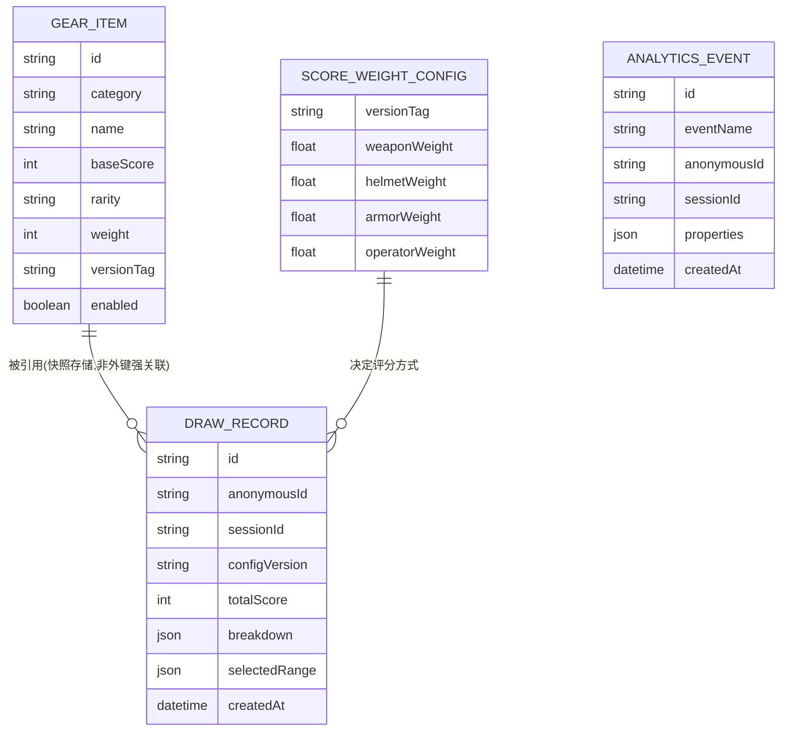

# 数据模型规范

> 版本:v0.1 最后更新:2026-07-21
> 本文件定义核心实体与字段契约。新增/修改字段必须先改本文件,再改 Prisma Schema / TypeScript 类型定义,保持三者一致。

## 1. 实体关系总览

> 说明:`DRAW_RECORD` 不与 `GEAR_ITEM` 建立数据库外键,而是**存储快照**(见第 3 节),因为配置数据会随版本变化,历史记录必须反映"抽取当时"的状态,不能随配置更新被动改变。

## 2. 配置数据实体(Config Data,来自 JSON 文件,非数据库表)

### 2.1 GearItem(装备/干员通用结构)

四类装备(武器/头盔/护甲/干员)共用同一套字段结构,通过 `category` 区分,便于后续扩展新的槽位类型(如"配件""饰品")而不改数据结构。

| 字段          | 类型                                          | 必填      | 说明                                                                       |
| ------------- | --------------------------------------------- | --------- | -------------------------------------------------------------------------- |
| `id`          | string                                        | ✅        | 全局唯一标识,建议格式 `{category}_{slug}`,如 `weapon_ak12`                 |
| `category`    | enum(`weapon`\|`helmet`\|`armor`\|`operator`) | ✅        | 装备类别,决定归属哪个抽取槶位                                              |
| `name`        | string                                        | ✅        | 展示名称(中文)                                                             |
| `subCategory` | string                                        | ❌        | 细分类别预留字段(如武器的"步枪/狙击枪"),V0.1 不强制使用,见 PRD 开放问题 1  |
| `baseScore`   | number(0-100)                                 | ✅        | 单项基础评分,由配置维护者依据强度评估赋值,详细打分标准见 `SCORING-SPEC.md` |
| `rarity`      | enum(`common`\|`rare`\|`epic`\|`legendary`)   | ❌        | 稀有度标签,用于前端展示与后续抽取权重参考                                  |
| `weight`      | number                                        | ❌,默认 1 | 抽取权重,数值越大越容易被抽到;不填则同类别内等概率                         |
| `imageUrl`    | string                                        | ❌        | 展示图片路径,V0.1 允许占位图                                               |
| `description` | string                                        | ❌        | 简介文案                                                                   |
| `versionTag`  | string                                        | ✅        | 所属配置版本号,如 `2026.07`                                                |
| `enabled`     | boolean                                       | ✅        | 是否参与抽取;用于"临时下架但保留历史数据"场景                              |

### 2.2 ScoreWeightConfig(评分权重配置)

| 字段             | 类型        | 必填 | 说明                   |
| ---------------- | ----------- | ---- | ---------------------- |
| `versionTag`     | string      | ✅   | 对应生效的配置版本号   |
| `weaponWeight`   | number(0-1) | ✅   | 武器在综合评分中的权重 |
| `helmetWeight`   | number(0-1) | ✅   | 头盔权重               |
| `armorWeight`    | number(0-1) | ✅   | 护甲权重               |
| `operatorWeight` | number(0-1) | ✅   | 干员权重               |

约束:四项权重之和必须等于 1(允许浮点误差 ±0.001),由配置加载阶段的 Schema 校验强制检查,详见 `CONFIG-SCHEMA.md`。

### 2.3 ConfigManifest(配置版本清单)

| 字段            | 类型   | 说明                                                    |
| --------------- | ------ | ------------------------------------------------------- |
| `activeVersion` | string | 当前生效的配置版本号                                    |
| `versions`      | array  | 已发布过的所有版本号及其发布时间、变更说明,用于追溯历史 |

## 3. 运行时数据实体(数据库表,由 Prisma 管理)

### 3.1 DrawRecord(抽取记录)

| 字段                                                           | 类型     | 说明                                                                                                      |
| -------------------------------------------------------------- | -------- | --------------------------------------------------------------------------------------------------------- |
| `id`                                                           | uuid     | 主键                                                                                                      |
| `anonymousId`                                                  | string   | 匿名访客标识,对应埋点体系的 `anonymous_id`                                                                |
| `sessionId`                                                    | string   | 会话标识,同一次访问周期内的多次抽取共享同一 sessionId                                                     |
| `configVersion`                                                | string   | 抽取发生时生效的配置版本号(快照依据)                                                                      |
| `weaponItem` / `helmetItem` / `armorItem` / `operatorItem`     | jsonb    | 抽取结果四个槶位的**装备快照**(完整复制当时的 GearItem 内容,而非仅存 id),保证历史数据不受后续配置变更影响 |
| `weaponScore` / `helmetScore` / `armorScore` / `operatorScore` | int      | 抽取当时的单项评分快照                                                                                    |
| `totalScore`                                                   | int      | 综合评分结果                                                                                              |
| `selectedMinScore` / `selectedMaxScore`                        | int?     | 用户当时设定的评分区间(为空表示未设定,即全区间随机)                                                       |
| `createdAt`                                                    | datetime | 创建时间                                                                                                  |

> 设计要点:**存快照而非存引用**,是为了满足 PRD F2 中"历史结果不因后续配置调整被篡改"的验收标准。数据库层面允许一定冗余,以换取数据正确性和简单性。

### 3.2 AnalyticsEvent(埋点原始事件)

| 字段          | 类型     | 说明                                                             |
| ------------- | -------- | ---------------------------------------------------------------- |
| `id`          | uuid     | 主键                                                             |
| `eventName`   | string   | 事件名称,枚举值见 `ANALYTICS-SPEC.md`                            |
| `anonymousId` | string   | 匿名设备标识                                                     |
| `sessionId`   | string   | 会话标识                                                         |
| `properties`  | jsonb    | 事件附加属性,结构随 `eventName` 不同而不同                       |
| `ipHash`      | string?  | IP 的哈希值(不存原始 IP),用于粗粒度地域/异常流量分析             |
| `userAgent`   | string?  | 客户端 UA,用于设备类型统计                                       |
| `createdAt`   | datetime | 事件发生时间(以服务端接收时间为准,V0.1 不额外处理客户端时钟偏移) |

### 3.3 DailyMetricSummary(每日聚合指标,由定时任务写入)

| 字段                    | 类型 | 说明                                                         |
| ----------------------- | ---- | ------------------------------------------------------------ |
| `date`                  | date | 统计日期(主键之一)                                           |
| `pv`                    | int  | 当日页面浏览量                                               |
| `uv`                    | int  | 当日独立访客数                                               |
| `drawCount`             | int  | 当日抽取次数                                                 |
| `newVisitorCount`       | int  | 当日新访客数(anonymous_id 首次出现)                          |
| `returningVisitorCount` | int  | 当日复访访客数                                               |
| `d1RetainedCount`       | int  | 计算得到的次日留存人数(基于 cohort,详见 `ANALYTICS-SPEC.md`) |

## 4. 字段命名与版本化约定

- 所有配置数据字段使用 `camelCase`,与 TypeScript/JSON 保持一致;数据库字段同样使用 `camelCase`(由 Prisma 映射到底层 snake_case 列名,应用层不感知差异)。
- `versionTag` 统一采用 `{年}.{月}[.{序号}]` 格式,如 `2026.07`、`2026.07.1`(同月内的补丁版本)。
- 任何新增字段默认视为可选(`?`),避免旧版本配置文件因缺字段而校验失败;若字段从"可选"改为"必填",必须在 `CONFIG-SCHEMA.md` 的变更记录中说明迁移方式。

## 5. 变更记录

| 日期       | 版本 | 说明             |
| ---------- | ---- | ---------------- |
| 2026-07-21 | v0.1 | 初版数据模型定义 |
